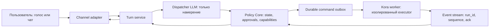

# Диспетчер ↔ Кора: целевая архитектура и план перехода

**Статус:** proposal, дополнен находками ревью кода 2026-07-14  
**Цель:** сделать диспетчер полезным разговорным слоем, а Core — единственным
источником истины, полномочий и аудита. Кора выполняет только явно выданный
run-manifest и не может повышать собственные права.

## Проблема

Сейчас часть критичных решений распределена между промптом, двумя путями
диспетчеризации (voice и HTTP), callback-ами `KoraBridge` и permission gate
внутри KoraRunner. Это создаёт три класса риска:

1. Поведение голосового и текстового каналов расходится. Например, текстовый
   путь добавляет `[СОСТОЯНИЕ]` в контекст, а голосовой строит только базовый
   системный промпт.
2. LLM участвует в принятии решений, которые должны быть детерминированными:
   подтверждение запуска, статус задачи, границы доступа.
3. Исполнитель имеет слишком широкую поверхность: Bash, файловая система и
   localhost control plane.

Отдельный P0: текущая проверка `/api/*` не является ни аутентификацией, ни
надёжной CSRF-защитой. Она сравнивает `Origin` и `Host`, но оба заголовка
контролирует вызывающий. При этом read-роуты, включая просмотр файловой системы
из `/api/browse`, не требуют даже этой проверки. До появления настоящей
идентичности клиента control plane следует считать открытым локальному процессу,
а не «защищённым tailnet-API».

Принцип целевой системы: **LLM интерпретирует намерение и формулирует речь;
она никогда не является источником полномочий или фактов о выполнении.**

## Целевая схема



### Роли компонентов

| Компонент | Может | Не может |
| --- | --- | --- |
| Channel adapter | Принять речь/текст, воспроизвести ответ | Менять задачу или права |
| Dispatcher LLM | Извлечь намерение, задать вопрос, выбрать разрешённое действие | Подтверждать запуск, сочинять статус, выдавать доступ |
| Policy Core | Хранить состояние, выпускать approval и capabilities, создавать run | Исполнять shell или менять файлы |
| Kora worker | Выполнить конкретный `RunManifest`, отправить факты | Вызывать control API, расширять свои права |
| Tool broker | Разрешать/отклонять инструмент по manifest | Принимать решения на основании текста LLM |

## Непереговорные инварианты

1. Любая команда и событие несут `thread_id`, `turn_id`, `task_id` и `run_id`.
   У операции есть idempotency key.
2. Любой запуск Коры требует явной отмашки пользователя для конкретного
   readback-свода задачи. Подтверждение создаётся только Policy Core из
   фактической реплики пользователя; булево поле, возвращённое LLM, не считается
   подтверждением. Более широкий доступ, side effect или изменённый свод требуют
   нового approval.
3. Статус отвечает Core. LLM может только озвучить уже подготовленный,
   versioned snapshot и не добавляет фактов.
4. Успешное завершение SDK-сессии не является доказательством выполнения
   пользовательской задачи. По умолчанию итог — `ResultProposed` / `unverified`;
   `ResultVerified` возникает только при конкретном, заранее определённом
   детерминированном verifier-е. Состояния `blocked`, `refused`, `failed` и
   `cancelled` различаются.
5. Кора не имеет сетевого пути к control plane и не владеет секретом,
   позволяющим его вызывать.
6. Права выдаются минимально и на время одного запуска. Расширение области
   доступа — отдельное действие с пользовательским одобрением.
7. Журнал привязан к конкретному ходу; параллельные ходы не разделяют
   глобальный `current` record.
8. Конкурентные tool-call-ы одного run детерминированы: broker сериализует
   решения и берёт per-path блокировку, чтобы два параллельных write на один
   путь не гонялись за файловой системой (CR-10).

## Контракты

### 1. Контекст хода

Оба канала используют одну фабрику `TurnContext`; voice и HTTP отличаются
только адаптером ввода/вывода.

```json
{
  "turn_id": "turn_…",
  "thread_id": "thread_…",
  "actor_id": "local-user",
  "user_text": "…",
  "state": {"version": 42, "task": null, "liveness": "ok"},
  "stage": "propose",
  "memory": {"summary": "…", "recent_messages": []},
  "allowed_intents": ["ask", "status", "propose_run", "cancel"]
}
```

`state.version` попадает в tool result и в аудит. Если состояние устарело,
Core перечитывает snapshot и повторяет композицию не более одного раза. При
втором конфликте он возвращает детерминированный «состояние изменилось,
попробуй ещё раз», а не запускает бесконечный и потенциально платный LLM-loop.

### 2. Идемпотентность и bounded retries

Ключ идемпотентности выдаёт Core на ingress, до вызова LLM:

- пользовательское сообщение: `(actor_id, client_message_id)`;
- команда Core→worker: `(run_id, command_type, command_revision)`;
- событие worker-а: `(producer_id, run_id, sequence)`.

Таблица `processed_operations` персистится вместе с outbox и имеет уникальные
индексы по этим ключам. Она переживает restart: повторная доставка возвращает
ранее записанный результат и никогда не повторно запускает run, cancel или
опасный tool call. Количество повторов LLM и обновлений `state.version`
ограничено в policy и пишется в аудит.

### 3. Решение диспетчера

Вместо неограниченного сочетания фразы и tool calls LLM возвращает один
проверяемый intent. Текст ответа остаётся свободным, но authority отделена от
него.

```json
{
  "kind": "propose_run",
  "user_facing_text": "Я подготовил свод. Отправить его Коре?",
  "request_summary": "…",
  "requires_approval": true
}
```

Допустимые `kind`: `reply`, `ask`, `status`, `propose_run`, `approve_run`,
`cancel`, `answer_kora`, `revise_request`. Schema validation выполняется до
Policy Core; неизвестный intent не исполняется.

Классификация `kind` остаётся best-effort работой LLM и не даёт ей полномочий.
В частности, `propose_run` создаёт только черновик и readback; даже matching
`approve_run` ничего не запускает, пока Core не увидит подходящую пользовательскую
реплику и не погасит выданный им `approval_id`.

### 4. Approval — обязательный start gate

Core создаёт approval после точной readback-фразы:

```json
{
  "approval_id": "apr_…",
  "task_digest": "sha256:…",
  "requested_capabilities": ["fs.write:/project/src/**"],
  "issued_at": "…",
  "expires_at": "…",
  "used": false
}
```

Ни `propose_run`, ни успешная классификация задачи не стартуют worker сами:
они только создают readback и pending approval. Вне этого состояния слово
«да», «делай» или похожая фраза не запускает Кору — оно не связано ни с каким
конкретным `task_digest`.

`ApprovalService` не пишется с нуля: он обобщает существующий `ConfirmFlow`.
Он сохраняет его проверенный double-key контракт — intervening user turn,
детерминированный affirm/deny classifier и digest/readback — но применяет его
также к `gate_action`, elevated capabilities и любому запуску кода. `approval_id`
одноразовый. Для режима «сразу писать код» требуется такой же approval, а не
`confirm=true` из tool call.

### 5. RunManifest

Кора получает не свободный текст с неявными правами, а immutable manifest:

```json
{
  "run_id": "run_…",
  "task_id": "task_…",
  "workspace": "/absolute/project",
  "instruction": "…",
  "capabilities": [
    {"operation": "read", "path": "/absolute/project/**"},
    {"operation": "write", "path": "/absolute/project/**"}
  ],
  "network": {"mode": "none"},
  "limits": {"turns": 40, "budget_usd": 1.0, "deadline_s": 900},
  "approval_id": "apr_…"
}
```

Изменить manifest после старта нельзя. Для нового пути, egress, shell или
внешней записи worker отправляет `capability_request`; Core показывает её
пользователю и при одобрении создаёт новый ограниченный grant.

## Модель доступа

### Базовый безопасный профиль

- Файлы: read/write только в выбранном project workspace.
- Секреты: не монтируются worker-у и не защищаются только denylist-ом имён.
- Сеть: выключена по умолчанию.
- Shell: отсутствует как raw-инструмент; разрешённые команды проходят через
  broker с аргументами и теми же capabilities файловой системы.
- Control plane: Unix socket или отдельный localhost endpoint с bearer/session
  credential, которого у worker нет.

### Режим доверенной локальной машины

Если пользователю действительно нужен «писать везде», это не меняет базовый
профиль. Core предлагает разовый grant, например `fs.write:/Users/me/Desktop/**`,
показывает его при readback и ограничивает одним run. Такой режим должен быть
видимым в UI и журнале как elevated access.

### Практическая изоляция

Предпочтительно запускать worker в контейнере или microVM с явными mount-ами и
без сети. Этот инвариант нельзя честно обеспечить, пока KoraRunner, control
plane и SDK-launch живут в одном доверенном runtime: процесс нельзя надёжно
изолировать от самого себя. Поэтому полное отсутствие сетевого пути worker→API
является целью фазы изоляции, а не ложным обещанием Фазы 0.

До неё остаётся явный принятый риск. Переходные меры снижают поверхность, но не
заменяют sandbox:

1. ввести настоящую authn/authz для всех read и write `/api/*`, не доверяя
   заголовкам `Origin`/`Host` как идентичности;
2. не передавать SDK-subprocess весь `os.environ`: применять env-allowlist,
   содержащий только обязательные для конкретного worker-а переменные;
3. не передавать browser/session/control-plane credentials в environment Коры;
4. вынести file/shell tools в отдельный broker process, как подготовку к
   будущей изоляции;
5. считать текущий lexical scan Bash только аудитом, а не security boundary.

После выделения worker-а в отдельный процесс с отдельным network namespace
можно реально блокировать исходящие соединения, включая localhost control plane.

## События и итог задачи

Worker публикует append-only события с монотонным `sequence`:

```text
RunAccepted → Heartbeat* → QuestionAsked? → CapabilityRequested? →
ToolFact* → ResultProposed → ResultVerified? | ResultUnverified | RunFailed | RunCancelled
```

Core подтверждает получение (`ack(sequence)`) и дедуплицирует повторную доставку.
Команды Core→worker также лежат в durable outbox до `RunAccepted`.

`ResultProposed` — нормальный terminal outcome по умолчанию, а не промежуточная
ошибка. Невозможно создать общий честный verifier для произвольной задачи вроде
«рефакторинг сработал?». Поэтому `ResultVerified` строится не по факту закрытия
Claude SDK и существует только для явно определённых проверок:

- worker сообщает структурированный итог: `completed|blocked|refused|failed`;
- broker прикладывает факты выполненных инструментов и изменения файлов;
- task policy может задать детерминированный verifier: тест, ожидаемый файл,
  миграцию, HTTP health check или другой конкретный критерий;
- если verifier не задан или его фактов недостаточно, итог остаётся
  `ResultUnverified`, а пользователь слышит нейтральное «Кора завершила запуск,
  но выполнение задачи не подтверждено».

Это убирает ложную формулировку «задача выполнена» после отказа модели.

### Cancel как протокол, а не локальный `asyncio.cancel()`

Отмена — durable команда `CancelRequested(run_id, idempotency_key)`, а не
неявная отмена coroutine в памяти. Worker обязан:

1. принять команду и записать `CancelAcknowledged`;
2. послать SDK/CLI кооперативную отмену или `SIGTERM` дочернему процессу;
3. после grace period эскалировать до `SIGKILL`, если процесс не завершился;
4. отправить один terminal `RunCancelled` либо `CancellationTimedOut`.

До terminal event Core не освобождает слот и не сообщает, что задача остановлена.
Повторные cancel-команды идемпотентны. Timeout — наблюдаемая деградация, а не
тихая подмена на `completed` или успешную отмену.

Отдельно: отмена рвёт поток и subprocess, но НЕ откатывает уже совершённые
side-effects. Файлы, записанные к моменту cancel/timeout, остаются, а workspace
замирает в промежуточном состоянии (CR-8). Пока нет атомарности, это явный
residual risk: `RunCancelled`/`CancellationTimedOut` означает «исполнение
остановлено», не «изменения отменены». Целевая мера — git-checkpoint (или иной
снимок workspace) ПЕРЕД run и возможность отката к нему; до неё Core обязан
сообщать пользователю, что частичные изменения могли остаться на диске.

## Долговременная память и журнал

Разделить два хранилища:

1. **Conversation feed** — полный append-only архив того, что видел пользователь.
2. **ConversationMemory** — персистентный summary, `source_event_range` и
   последние сообщения для LLM.

Компактация должна сохранять сам summary, а не только событие «контекст сжат».
После restart voice и HTTP читают один `ConversationMemory`, поэтому не
расходятся и не повторно сжимают сырую историю.

`TurnJournal` становится интерфейсом вида:

```python
async with journal.turn(turn_context) as record:
    ...
```

Каждый tool handler получает явный `OperationContext`, а не читает глобальный
`_current` и fallback `_last_turn_id`. Так retries безопасно используют один
idempotency key, а одновременные треды не смешивают аудит.

### Audit log — несущая запись Core

Audit — не побочный JSONL-лог, а append-only хранилище решений Core. Минимальный
`AuditEvent` содержит:

```json
{
  "event_id": "evt_…",
  "occurred_at": "…",
  "type": "approval_issued|command_enqueued|policy_denied|run_event|…",
  "actor": {"kind": "user|dispatcher|worker", "id": "…"},
  "correlation": {"thread_id": "…", "turn_id": "…", "task_id": "…", "run_id": "…"},
  "idempotency_key": "…",
  "input_digest": "sha256:…",
  "policy_version": "…",
  "state_before_version": 41,
  "state_after_version": 42,
  "decision": "allow|deny|propose|ack",
  "approval_id": "apr_…",
  "capability_refs": ["cap_…"],
  "source_refs": ["repo:path:line"],
  "redacted_detail": {"…": "…"}
}
```

События хранятся транзакционно рядом с outbox и dedup-таблицей (на первом этапе
достаточен SQLite). Индексы по `thread_id`, `task_id`, `run_id`, `turn_id`, времени
и типу позволяют ответить: кто что запросил, почему Core разрешил/отклонил,
какой manifest получил worker и чем завершился запуск. Секреты, raw tool inputs,
chain-of-thought и голосовые записи в audit не пишутся.

## Диспетчер-интервьюер, а не «попугай»

Главная работа диспетчера — не принимать готовое ТЗ, а помогать пользователю
раскрыть собственную идею. Он ведёт адаптивное интервью: понимает замысел,
выясняет проблему и желаемый эффект, замечает противоречия, предлагает рамки
решения и постепенно превращает смутную мысль в ясный запрос.

Знание выбранного репозитория — основа этого поведения. Оно позволяет сначала
самому найти существующие компоненты, соглашения и ограничения, а не перекладывать
работу исследования на пользователя. Затем диспетчер решает, нужен ли разговор
об идее: короткая ясная правка в известном месте не требует интервью; новая или
противоречивая продуктовая задумка — требует.

Это не следует решать только новым промптом: модель идеи и ход интервью должны
быть структурированными и передаваться LLM на каждом ходе.

### Idea Brief — живая модель замысла

У каждого треда до всякого запуска есть `IdeaBrief`. Это не формальное ТЗ и не
анкета, а текущая, редактируемая карта того, что пользователь пытается создать:

```json
{
  "one_line_idea": "…",
  "problem": "какая боль или возможность за этим стоит",
  "audience": ["для кого"],
  "desired_change": "что должно стать возможно или проще",
  "scenario": ["как этим будут пользоваться"],
  "success_criteria": ["как поймём, что получилось"],
  "constraints": ["срок, деньги, приватность, платформа"],
  "non_goals": ["что сознательно не делаем"],
  "assumptions": ["пока непроверенные гипотезы"],
  "decisions": ["что уже выбрано пользователем"],
  "open_gaps": ["что действительно мешает перейти к следующему шагу"]
}
```

Каждая запись несёт provenance: это слова пользователя, предположение
диспетчера или проверенный факт. Диспетчер никогда не выдаёт своё предположение
за решение пользователя.

Пример правильного поведения: вместо повторения «уточните задачу» он говорит:
«Я понял идею так: X для Y, чтобы стало Z. Пока неясно, важнее ли скорость
первого результата или точность. Это действительно главный выбор?»

### Режимы разговора

1. **Explore** — свободно раскрыть идею: зачем это нужно, кому, какой опыт или
   изменение хочется получить. Здесь не надо преждевременно спрашивать путь к
   файлу, модель или архитектуру.
2. **Shape** — собрать сценарий, ограничения, критерии успеха, риски и
   альтернативы; подсветить противоречия.
3. **Decide** — предложить 1–3 осмысленных направления с trade-off-ами и
   зафиксировать выбор пользователя.
4. **Plan** — сформировать свод, этапы и только затем при необходимости
   подключить Project Brief и Кору.

Переход режима — решение Core по заполненности `IdeaBrief`, а не случайный
эффект длины чата или желания модели задать ещё один вопрос.

### Адаптивная policy: когда действовать, а когда спрашивать

Поведение не должно быть одним и тем же для каждой задачи. До ответа
диспетчер строит `TaskAssessment` по тексту пользователя и свежему контексту
репозитория:

```json
{
  "mode": "execute|clarify|explore|plan",
  "repo_confidence": "high|medium|low",
  "impact": "low|medium|high",
  "reversibility": "easy|hard",
  "missing_decision": "…",
  "evidence": ["src/auth/session.py", "docs/architecture.md"],
  "reason": "…"
}
```

| Режим | Когда включается | Поведение диспетчера |
| --- | --- | --- |
| `execute` | Задача ясна, релевантный код найден, изменение обратимо или покрыто проверками | Не устраивает интервью. Коротко отражает понимание и сразу показывает readback; Кора стартует только после явной отмашки пользователя. |
| `clarify` | Есть один пробел, который меняет реализацию или результат | Сначала ищет ответ в репозитории; если не нашёл — задаёт один конкретный вопрос с объяснением выбора. |
| `explore` | Пользователь формирует идею, аудитория/проблема/сценарий ещё не определены | Ведёт интервью по `IdeaBrief`, помогает увидеть варианты и trade-off-ы. Ничего не запускает. |
| `plan` | Задача затрагивает несколько подсистем, необратима, дорога или высокорискова | Показывает план, области изменения, риски и требуемые capabilities; ждёт approval. |

Правило выбора вопроса:

> Сначала исследуй то, что можно узнать из репозитория. Спроси пользователя
> только если две разумные реализации приводят к разным пользовательским
> результатам, рискам или затратам и репозиторий не даёт основания выбрать.

Поэтому диспетчер не спрашивает «где находится файл?» или «какой у вас стек?»,
если это можно установить самому. Но он спрашивает «для кого важнее X или Y?»
или «можно ли менять публичный контракт?», когда это действительно решение
владельца идеи.

`TaskAssessment` — не неявное настроение LLM. Его сохраняет Core вместе с
evidence и причиной перехода. Для `impact=high`, внешних side effects и
расширения доступа deterministic policy может только повысить режим до `plan`,
но не понизить его по уверенности модели.

### Project Brief

Для каждого проекта Core поддерживает безопасный, обновляемый `ProjectBrief`:

```json
{
  "project_id": "…",
  "root": "/absolute/project",
  "stack": ["Python", "FastAPI"],
  "entrypoints": ["synapse/pipeline/app.py"],
  "commands": {"test": "pytest -q", "run": "python -m synapse.pipeline.app"},
  "architecture": ["dispatcher", "policy core", "kora worker"],
  "active_docs": ["docs/…"],
  "known_constraints": ["одна активная Кора в v1"],
  "updated_at": "…",
  "source_revision": "…"
}
```

Он строится индексатором/репозиторным адаптером из разрешённых файлов,
метаданных и явных проектных документов. Сырым доступом к всей файловой системе
диспетчер не обладает. Секреты, `.env`, внутренние размышления Коры и content
инструментов в brief не попадают.

`ProjectBrief` — быстрый старт, не слепок, который вечно лежит в prompt.
Для каждого `TaskAssessment` Core запрашивает свежий узкий `RepoContext`: по
путям, символам, тестам, документации и git-изменениям, относящимся к задаче.
Так диспетчер ведёт себя ближе к Claude Code: сначала смотрит на реальный код,
а не задаёт вопрос, ответ на который уже есть в репозитории. В первом варианте
не нужны векторная БД или тяжёлый knowledge graph — достаточно репо-индекса,
поиска по символам/тексту и явных source references в контексте.

После запуска Коры brief обновляется только проверяемыми фактами: изменённые
файлы, прошедшие проверки, новый план, terminal outcome. Нельзя обновлять его
непроверенным текстом или цепочкой рассуждений модели.

### Discovery state треда

Помимо свободного summary каждый тред хранит именно состояние интервью:

```json
{
  "goal": "…",
  "known_facts": ["…"],
  "constraints": ["…"],
  "decisions": ["…"],
  "open_questions": [
    {"id": "q-auth", "question": "Какой механизм auth нужен?", "why": "…"}
  ],
  "answered_questions": ["q-scope"],
  "last_question_id": "q-auth",
  "readiness": "collecting|ready_to_propose|approved"
}
```

Каждый ответ пользователя сначала извлекается в Idea Brief / Discovery state и
получает provenance (`user`, `dispatcher_hypothesis`, `project_brief`,
`verified_run_fact`). Только затем
диспетчер выбирает следующую реплику. Если новая реплика закрывает вопрос,
вопрос помечается решённым и больше не задаётся без явного изменения вводных.

### Политика интервью

1. Сначала проверить Idea Brief, `known_facts`, `answered_questions` и уже
   принятые решения. Не спрашивать то, что уже известно.
2. В режимах Explore/Shape выбирать вопрос с наибольшей информационной
   ценностью для замысла: проблема, аудитория, сценарий, критерий успеха или
   ограничение. Не перескакивать сразу к реализации.
3. Задавать только вопрос, который меняет понимание идеи, решение, границы
   задачи или план. Вопросы «для поддержания диалога» запрещены.
4. Объединять независимые пробелы максимум в одну короткую пачку вопросов.
   Если контекста достаточно — показать, как диспетчер понял идею, и предложить
   следующий шаг.
5. Перед повторным вопросом явно показать противоречие или устаревший источник:
   «Раньше выбрали X, сейчас прозвучало Y — что считать актуальным?»
6. На мета-вопросы отвечать по Idea Brief, Project Brief и состоянию запуска: кто такой
   диспетчер, что он знает, чего именно не хватает и почему. Не повторять
   шаблон «я только диспетчер», когда пользователь просит объяснение.
7. Если данных о проекте нет или brief устарел, честно запросить безопасное
   обновление brief либо один конкретный факт у пользователя — не делать вид,
   что проект известен.

### Контракт ответа LLM

К динамическому контексту LLM добавляются отдельные блоки:

```text
[IDEA_BRIEF]          текущая модель замысла, решения и гипотезы
[CONVERSATION_MODE]   explore, shape, decide или plan
[PROJECT_BRIEF]       проверенные сведения о проекте
[THREAD_DISCOVERY]    цель, решения, закрытые и открытые вопросы
[СОСТОЯНИЕ]           снимок активного запуска
[INTERVIEW_POLICY]    правила выбора следующего вопроса
```

В `DispatcherDecision` для `ask` обязательны `question_id`, `why_needed` и
`closes`. Core отклоняет вопрос, который уже закрыт или не относится к
открытому пробелу. Для `propose_run` обязательны ссылки на факты и решения,
из которых получился свод.

Так prompt остаётся инструкцией по тону и языку, а защита от «попугая» живёт в
данных и policy:

- ответ диспетчера развивает модель идеи, а не повторяет просьбу «уточнить»;
- он знает, что уже сказано и что из этого является гипотезой;
- один и тот же вопрос имеет устойчивый id и не повторяется;
- проектный контекст подключается тогда, когда он полезен для идеи;
- при достаточной определённости диспетчер обязан переходить к своду, а не
  продолжать интервью.

### Метрики качества

Нужны продуктовые метрики, иначе деградация промпта будет видна только руками:

- `repeated_question_rate` — доля вопросов, уже закрытых в этом треде;
- `clarification_turns_to_proposal` — число ходов до свода;
- `idea_coverage` — заполненность проблемы, аудитории, сценария, критериев и
  ограничений без искусственного принуждения к каждому полю;
- `brief_staleness` — возраст и revision Project Brief;
- `unsupported_project_claims` — утверждения о проекте без provenance;
- `meta_question_helpfulness` — ручная оценка ответов «почему/что ты знаешь».

Целевой тестовый сценарий: пользователь приходит с фразой «хочу сделать
что-то, чтобы …». Диспетчер отражает понятый замысел, выбирает один полезный
вопрос о проблеме/аудитории/сценарии, помечает ответ как известный и не
возвращается к нему. Когда идея достаточно ясна, он предлагает свод и варианты
следующего шага; Project Brief использует только для приземления этого варианта
на существующий продукт.

## Находки ревью кода (2026-07-14)

Ревью живого кода подтвердило разделы «Проблема» и «План миграции» — ни один из
названных там рисков не устарел. Ниже конкретные привязки к коду и пункты,
которых в плане ещё не было (CR-1…CR-6, на них ссылаются фазы).

### Конкретизация уже известных рисков

- **Voice/HTTP расходятся сильнее, чем описано.** HTTP-путь собирает
  `system_prompt + state_block` (`synapse/dispatcher/loop.py:238`), голосовой
  `_on_end_of_turn` строит только `build_system_prompt(cfg, stage_block=…)`
  (`synapse/pipeline/app.py:844`) — без снапшота состояния и словаря задач.
  Хуже: вопрос Коры инжектится как `TTSSpeakFrame(append_to_context=False)`
  (`synapse/pipeline/app.py:207`), то есть голосовой LLM не видит сам вопрос —
  роутинг `answer_kora` держится на том, что модель догадается позвать
  `get_task_status`. Live-прогон это однажды прошёл, но гарантия
  вероятностная, не структурная.
- **Cost cap не покрывает текстовый канал вовсе.** `text_loop` работает на
  голом `AnthropicLLMClient` (`synapse/pipeline/app.py:716`) мимо `CostCap` и
  `CircuitBreaker`; компакт-вызовы `_maybe_compact` идут тем же неучтённым
  клиентом. Весь механизм дневного лимита живёт только в голосовом каскаде
  (`_CostCountingLLMSwitcher`).
- **Компакт-summary эфемерен.** `_maybe_compact` заменяет голову истории на
  `[КОМПАКТ] …` только в памяти; рестарт или LRU-эвикшн
  (`_MAX_CACHED_THREADS = 64`) регидрирует полную сырую ленту, и следующий ход
  снова платит за компакт. Это прямой довод за персистентный
  `ConversationMemory` из раздела «Долговременная память».
- **«Задача выполнена» произносится чисто по `is_error == False`**
  (`synapse/bridge/kora.py:279`): отказ модели, вежливо завершившей сессию,
  звучит как успех — в голосовом интерфейсе это ложь в ухо. Довод за
  `ResultProposed`-default (инвариант 4).
- **Bash-ветка гейта — полный сетевой egress.** Deny на WebFetch/WebSearch
  символичен: exfil-канал открыт через `curl`. Лексический секрет-скан
  обходится тривиально (`cat ~/.e"n"v`, glob, base64) — это аудит, не граница;
  план уже говорит это словами, здесь — подтверждение по коду.

### Новые пункты (в плане не было)

- **CR-1. Мина в `SynapseHost`: сеттер инициализирует чужие поля.** Сеттер
  `current_http_thread` (`synapse/pipeline/app.py:159-170`) содержит внутри
  себя инициализацию `_output_task` и `_gate_locks` — разъехавшийся edit
  (комментарий в `__init__` обрывается на полуслове, `app.py:153`). Сейчас
  работает случайно: присваивание в `__init__` дёргает сеттер один раз. Но
  любое повторное `host.current_http_thread = …` молча отвяжет живой
  `PipelineTask` (тихий дроп SPEAK — класс B17) и сбросит все per-thread
  гейт-локи посреди single-flight; такое присваивание уже существует в
  `tests/test_b_pipe_bugs.py:180`. Фикс: перенести инициализацию в `__init__`,
  склеить комментарий.
- **CR-2. Кора может переписать собственный аудит и стейт хоста.** Gate v3
  «писать везде, кроме секретов» не закрывает `journal_dir` (`state.json`,
  ленты тредов, журнал) и репозиторий Синапса. Один `Write` — и исполнитель
  выставляет себе `task_completed`, подтирает `gate_deny`-записи или
  подкидывает реплики в ленту, из которой потом регидрируется контекст
  диспетчера. Дешёвая инкарнация инварианта 5: оба пути в deny-список гейта
  уже сейчас, не дожидаясь broker-а.
- **CR-3. Дедлайн рана включает время раздумий человека.**
  `asyncio.wait_for(self._stream(…), kora_deadline_s)`
  (`synapse/bridge/kora.py:499`) оборачивает и парковку `AskUserQuestion`:
  поздний ответ пользователя убивает ран таймаутом, ответ падает в
  `no_pending_question`. Пока задача в `awaiting_answer`, таймер должен стоять
  (или парковка выносится за пределы `wait_for`).
- **CR-4. Асимметрия answer-гвардов.** `_voice_answer` пропускает ответ при
  `voice_thread=None` (`synapse/pipeline/app.py:629`), `_http_answer` — строго
  только из треда-владельца. Либо зафиксировать осознанность комментарием,
  либо закрыть гвард симметрично.
- **CR-5. Незаякоренный инвариант busy-чека гейта.** `gate_action` корректен
  только потому, что между `has_active_task()` и `_launch_run` нет ни одного
  await (гейт-локи — per-thread, не per-host). Появится await — два треда
  запустят две Коры на одном глобальном сторе. Нужен тест-якорь на
  «нет-await» либо явный host-level lock вокруг busy-check+launch.
- **CR-6. Хозяйство.** `tests/test_b_pipe_bugs.py`,
  `tests/test_concurrency_race.py` и `staging_*.py` не закоммичены —
  регрессионные якоря уже закоммиченных фиксов живут без истории и теряются
  вместе с рабочей копией.
- **CR-7. У текстового канала нет fallback-а на ошибке/таймауте LLM.** Раздел
  про cost cap фиксирует, что `text_loop` ходит через голый
  `AnthropicLLMClient`, но не то, что этот путь вообще не переживает падение
  провайдера. `complete()` делает `resp.raise_for_status()`
  (`synapse/dispatcher/llm_client.py:87`); `ingest_user_turn` ловит исключение
  только чтобы закрыть turn и перевыбросить
  (`synapse/dispatcher/loop.py:210-215`); роут
  `POST /api/threads/{id}/message` оборачивает вызов в `try/finally` без
  `except` (`synapse/pipeline/webrtc_server.py:585-589`) → 500 без
  детерминированного ответа. На голосе есть `ALL_TIERS_FAILED_PHRASE` +
  `render_state_template`; на тексте — ничего. Нужен детерминированный
  текстовый fallback.
- **CR-8. Нет отката FS/git side-effects при cancel и timeout.** «Cancel как
  протокол» описывает терминальные события, но не судьбу уже записанных файлов.
  `asyncio.Task.cancel` рвёт поток и subprocess, но не откатывает мутации ФС;
  git-состояние рабочего каталога никем не отслеживается (grep
  `git|rollback|checkpoint` по `synapse/bridge/` пуст). Что Кора успела записать
  к моменту отмены — остаётся, workspace замирает в промежуточном состоянии.
  Это residual risk и пункт плана: атомарность side-effects / git-checkpoint
  перед run.
- **CR-9. Кора — доверенный рассказчик, а display-лента пишет значения
  tool-инпутов.** Документ описывает `ToolFact` как цель (broker прикладывает
  факты), но не помечает текущее состояние как риск: worker сам контролирует
  `assistant_text` и может заявить «файл создан» — это уходит в NARRATABLE-
  сердцебиение и display без независимой проверки
  (`synapse/bridge/kora.py:254`, `:221-289`). Хуже: `/client/kora-log` через
  `_message_to_log_entries` пишет ЗНАЧЕНИЯ tool_use-инпутов
  (`synapse/bridge/kora.py:324-330`) — осознанное исключение из keys-only.
  Секрет, просочившийся в workspace не через секрет-путь и попавший в инпут,
  оказывается в ленте. Этой поверхности в документе нет совсем.
- **CR-10. Concurrent tool calls: гонка записи на один путь.** SDK может
  выпустить параллельные tool-call-ы в одном `UserMessage` (гейт различает их по
  `tool_use_id`, `synapse/bridge/kora.py:335`), но `_pretool_hook` решает каждый
  call изолированно, без сериализации и per-path блокировки. Два параллельных
  `Write` на один путь — гонка ФС. Детерминизм конкурентных tool-call-ов нужно
  внести в «Непереговорные инварианты».

### Стоит уточнить (расхождения кода и целевого текста, не новые риски)

- **RunSpec vs RunManifest.** В коде сегодня
  `RunSpec(thread_id, project_root, gate_mode, model)`
  (`synapse/bridge/runspec.py:11-21`); документ везде оперирует целевым
  `RunManifest` с `capabilities[]`, `limits`, `approval_id`. При чтении кода
  рядом с доком это коллизия — развести явно: **сегодня RunSpec, цель
  RunManifest**.
- **Enforcement `budget`/`turns`/`deadline` целиком на SDK.** `max_turns` и
  `max_budget_usd` передаются в Claude SDK
  (`synapse/bridge/kora.py:619-620`); своего runtime-учёта `budget_usd` нет
  (`total_cost_usd` только читается из `ResultMessage` для display), единственный
  собственный лимит — wall-clock `wait_for`. `limits` в `RunManifest` поданы как
  авторитетные для Core — пометить, что сейчас это best-effort со стороны SDK.
- **Resume/checkpoint отсутствует полностью.** Краш mid-run → zombie-реконсил в
  `FAILED` с reason «сервер перезапускался»
  (`synapse/bridge/state.py:441-458`); стрим и прогресс теряются. Фаза 3
  упоминает resumable runs, но текущее состояние как residual risk не
  зафиксировано.
- **`task_dictionary` де-факто всегда пустой.** Параметр есть
  (`synapse/dispatcher/loop.py:80,93,236`), но в `build_host`
  `DispatcherTurnLoop` создаётся без него → `{}`. Документ ссылается на «словарь
  задачи» как на рабочий механизм — мелочь, но вводит в заблуждение.
- **Нет latency-бюджета голоса.** Голос — основной канал, а SLA/latency-cap в
  документе почти не освещён (есть только `request_timeout_s`). Для realtime-
  интерфейса это отдельный продуктовый бюджет.

## План миграции

### Фаза 0 — устранить текущие P0-риски

1. Создать `build_turn_context()` извлечением текущей инлайн-сборки из
   `DispatcherTurnLoop._complete`; использовать фабрику в `DispatcherTurnLoop`
   и `build_session_pipeline`. Проверка: в каждом voice и HTTP вызове есть один
   и тот же `[СОСТОЯНИЕ]` snapshot.
2. Закрывать нормальные voice и HTTP turns через реальную пару
   `begin_turn()`/`end_turn()`. Одновременно заменить singleton journal context
   на явный `turn_id` на границе handlers и удалить зависимость handlers от
   fallback `_last_turn_id`.
3. Обобщить существующий `ConfirmFlow` в `ApprovalService` для `gate_action`:
   `confirm` от LLM перестаёт быть authority, появляется одноразовый
   `approval_id`.
4. Ввести request-time блокировку cost cap; после исчерпания лимита запрос не
   уходит в paid tier.
5. Ввести настоящую authn/authz для всех `/api/*`, включая read-роуты, и убрать
   доверие к `Origin`/`Host` как механизму доступа.
6. Добавить env-allowlist при запуске SDK/CLI subprocess, чтобы он не наследовал
   все ключи из окружения приложения.
7. Закрыть `journal_dir` и репозиторий Синапса в deny-списке гейта (CR-2): пока
   worker живёт в одном runtime с Core, он не должен писать в собственный аудит
   и стейт хоста.
8. Остановить `kora_deadline_s`, пока задача паркована на `AskUserQuestion`
   (CR-3), чтобы время раздумий человека не убивало ран.
9. Добавить детерминированный текстовый fallback (CR-7): падение/таймаут
   провайдера в `POST /api/threads/{id}/message` даёт не 500, а
   детерминированную реплику — текстовый аналог голосового
   `ALL_TIERS_FAILED_PHRASE`/`render_state_template`, без ухода в платный tier.
10. Мелкий, но обязательный дренаж перед всем перечисленным: починить сеттер
   `current_http_thread` (CR-1) — перенести инициализацию `_output_task`/
   `_gate_locks` в `__init__`; заякорить busy-check гейта тестом на «нет-await»
   (CR-5); закоммитить `tests/test_b_pipe_bugs.py`,
   `tests/test_concurrency_race.py`, `staging_*` (CR-6).

**Definition of done:** регрессионные тесты доказывают, что voice получает state,
два параллельных хода не делят journal record, LLM не может самостоятельно
подтвердить запуск, control API требует настоящую идентичность, SDK-subprocess
не получает лишние credentials, а Кора не может писать в `journal_dir`. Сетевой
запрет worker→control plane в этой фазе не обещается: он требует отдельной
изоляции и остаётся явным residual risk.

### Фаза 1 — единый orchestration core

1. Ввести `TaskRegistry` вместо глобального `TaskStore`; политика «одна Кора»
   остаётся конфигурацией очереди, а не свойством модели данных. Заменить
   `should_hide_task` на явную `ThreadTaskView`: терминальный run остаётся видим
   в собственном треде, а не маскируется глобальным singleton-workaround.
2. Заменить callbacks `on_task_committed/on_cancel/on_gate` на command handler
   и durable outbox; рядом завести транзакционные audit и dedup-таблицы.
3. Ввести `RunManifest`, `RunAccepted`, sequence/ack и cancel protocol.
4. Сделать terminal outcome `ResultProposed` по умолчанию; подключать только
   task-specific optional verifiers, которые могут выдать `ResultVerified`.
5. Сохранить `ConversationMemory`, `TaskAssessment` и версию state в thread storage.
6. Добавить Project Brief и Discovery state; перевести COLLECT/PROPOSE на
   question IDs и проверку повторов в Core.
7. Добавить `RepoContext` и `TaskAssessment`: режим `execute`, `clarify`,
   `explore` или `plan` выбирается до запуска и сохраняет свои evidence.

**Definition of done:** restart не теряет принятый запуск; повтор команды или
события не выполняет действие дважды; audit отвечает на вопрос «кто/почему/с
каким доступом»; text и voice проходят одну intent/policy цепочку.

### Фаза 2 — capability broker и изоляция

1. Вынести файловые и shell-инструменты за пределы Kora SDK в broker.
2. Добавить profile `workspace`, разовый elevated grant и UI/readback для него.
3. Выделить worker в отдельный процесс, затем запустить его в container/microVM
   с отдельным network namespace и без сети по умолчанию.
4. Убрать безопасность, зависящую от denylist имён секретов и lexical Bash scan.
5. Ввести git-checkpoint (или снимок workspace) перед каждым run и откат к нему
   на cancel/timeout/failed (CR-8); сериализовать решения broker-а и per-path
   блокировку конкурентных tool-call-ов (CR-10).

**Definition of done:** попытки прочитать секрет, написать вне manifest или
достучаться до control plane блокируются вне LLM и фиксируются аудитом; отмена
рана оставляет workspace в известном состоянии (откат к checkpoint либо явное
сообщение о частичных изменениях); два конкурентных write на один путь не
гоняются.

### Фаза 3 — масштабирование

1. Добавить очередь и несколько workers, не меняя API dispatcher-а.
2. Ввести scheduler по project/priority/budget.
3. Добавить resumable runs и явную передачу владения между устройствами.

## Решения, которые не стоит откладывать

- Считать текущую защиту `/api/*` иллюзией: `Origin`/`Host` контролирует клиент,
  а часть read-роутов открыта вовсе. Ввести authn/authz до расширения экспозиции.
- Не давать LLM булево подтверждение полномочий.
- Не использовать успешный `ResultMessage` как доказательство результата задачи.
- Не расширять raw Bash до появления независимой sandbox/broker boundary.
- Не лечить расхождение voice/HTTP новыми промптами: нужен единый TurnContext и
  единый Policy Core.

## Первый implementation slice

Самый безопасный следующий PR ограничить следующими изменениями:

1. Создать `TurnContext` и одинаковый state block в voice/HTTP.
2. Явный lifecycle `journal.begin_turn/end_turn` и `OperationContext(turn_id)`
   в tools.
3. Обобщить `ConfirmFlow` для `gate_action`, без доверия к `confirm` от LLM.
4. Тесты на self-approval, попытку запуска без pending approval, invalidation
   approval после смены свода, cross-turn journal mixing и отсутствие state в voice.

Этот PR не решает изоляцию worker-а и не должен заявлять обратного. Он создаёт
правильную границу для следующей очереди, run-manifest, capability broker-а и
выделения worker-а в отдельный sandboxed runtime.
